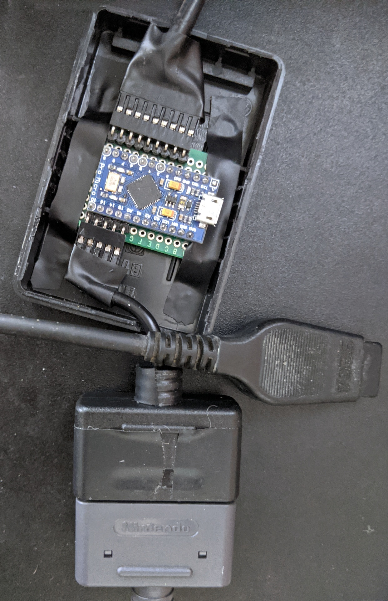
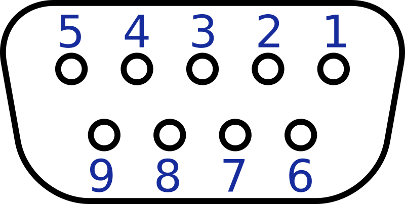
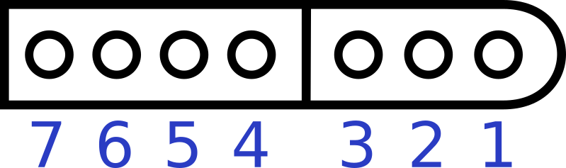

# sfc2md

This program for AVR microcontrollers allows playing Genesis/Mega Drive with a
Super Nintendo/Super Famicom controller.

# Features

This program emulates a 6-button controller by default.  It was created
primarily to play Xeno Crisis, so the default button mapping is optimized for
that game: face buttons shoot directionally, R rolls, L throws grenade, Select
drops weapon, Start pauses.

For games that use A as primary action and B to jump (and C for a secondary
action, if applicable), hold Left on the controller when powering on the
console.  This maps action and jump to Y and B on the controller, and A to the
secondary action, which is typical and intuitive for SNES/SFC games.

For games that use B as the primary action and C to jump (and A for a secondary
action), hold Right when powering on instead.

In either of the above mappings, L, X, and R on the controller map to
Genesis/MD buttons X, Y, and Z respectively.  Start and Select always map to
Start and Mode.

To act as a 3-button controller, hold Select when powering on the console.
This can be combined with one of the above directions.  Some games may require
this, although in my testing so far I've found this adapter to be more
compatible than the official 6-button controller.

The adapter introduces about 1.67 milliseconds of input latency on NTSC region
(60 Hz) games.  It introduces 5 milliseconds on PAL region (50 Hz) games -- not
ideal, but so is playing Mega Drive games at 50 Hz.

# Building the Code

A simple `Makefile` is provided.  The `upload` target will program an
ATmega32U4 on Linux with `avrdude`.  You may need to modify the file for your
MCU, OS, and programmer.

# Hardware and Requirements

The prototype uses an ATmega32U4 board and some spare controller/extension cables
spliced together.  I used Dupont connectors and put it in an old AC adapter housing
to keep things a bit more clean.

The MCU needs to run at 16MHz or more to keep up with the Genesis/MD.  Pin
assignments may need to be changed depending on your MCU and wiring.

The best way to get the appropriate plugs is to buy extension cables and cut
them up.  You will want to wire the plugs to your MCU as follows:

## Genesis/Mega Drive connector (DE-9)

Looking into the connector on the controller cable (be sure not to get this
reversed!):

| Pin | Name   |
|-----|--------|
| 1   | D0     |
| 2   | D1     |
| 3   | D2     |
| 4   | D3     |
| 5   | +5V    |
| 6   | D4     |
| 7   | Select |
| 8   | GND    |
| 9   | D5     |

## SNES/Super Famicom connector (proprietary)

The shape of the connector makes orientation unambiguous, thankfully:

| Pin | Name   |
|-----|--------|
| 1   | GND    |
| 2   | Unused |
| 3   | Unused |
| 4   | Data   |
| 5   | Latch  |
| 6   | Clock  |
| 7   | +5V    |

## MCU

The default pin assignments using the same names as in the above tables are
found prominently in the [source code](sfc2md.c).  If you aren't using the same
board that I am, you'll most likely have to change them to match your wiring.
All Genesis/MD data lines (D0-D5) must be on the same port register so that
they can be updated in a single instruction.

I noticed substantial crosstalk during output switching on my oscilloscope, so
you may want to put small resistors on the Genesis/MD data lines (D0-D5) to
limit slew rate.  It worked fine regardless.

# Implementation Notes

The implementation is highly optimized in order to keep up with the stringent
timing requirements of Genesis/MD controller polling.  The original 3-button
controller is simply a high-speed CMOS multiplexer on the end of a cable, so it
can be expected to switch outputs within 10 nanoseconds or so.  Many games are
therefore very aggressive about reading the outputs after toggling the select
line.  My testing suggests that response times need to be kept under 700
nanoseconds or so to prevent games from reading bogus inputs.

To respond as quickly as possible, the select line is polled using busy waits
in a manually unrolled main loop.  The generated assembly was inspected
to ensure that each busy wait consists of a two-instruction loop followed by
an immediate write to the output port register once the select line toggles.

The 6-button controller exposes additional buttons by a "handshake" with the
game where it polls the controller extra times each frame.  After two polling
cycles within a short time window, the third negative edge of the select line
causes the controller to drive D0-D4 low.  This is normally impossible (it
would indicate all 4 cardinal directions on the directional pad being pressed
simultaneously), so it identifies the controller as being 6-button to the game.
On the following positive edge, the additional button states are output on
D0-D4.

To maintain backward compatibility with games expecting 3-button controllers,
the 6-button controller reverts to 3-button behavior if the game does not
complete all polling cycles within a millisecond or so.  This program uses
a timer interrupt to accomplish the same behavior.  To prevent slowing down
the busy waits with tests for a timeout flag, the interrupt instead overwrites
the return address on the stack so that the main loop immediately jumps to
a special label upon return, resetting the loop.  This is also when polling
of the SNES/SFC controller is performed.  The timeout is tuned so that the
SNES/SFC controller is polled as close as possible to the game polling the
adapter, minimizing input latency.

The SNES/SFC controller is essentially a 16-bit shift register on the end of a
cable, so polling it consists of issuing a pulse to latch the inputs into the
register, followed by clocking out the button states one at a time.  The
timings used are approximately those used by a real console, so controller
compatibility should be high.
